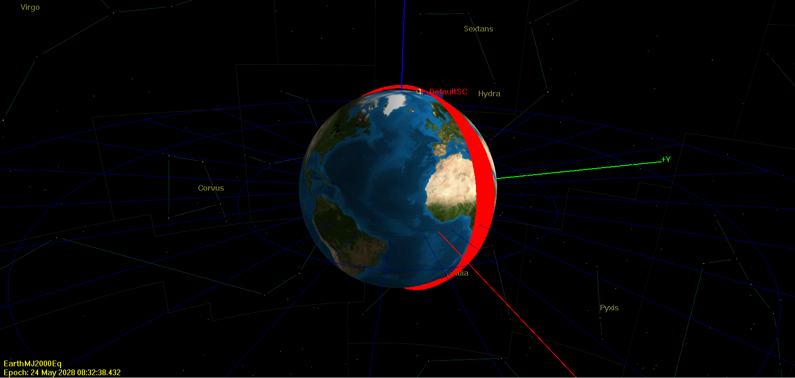
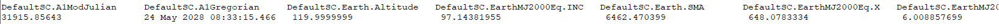
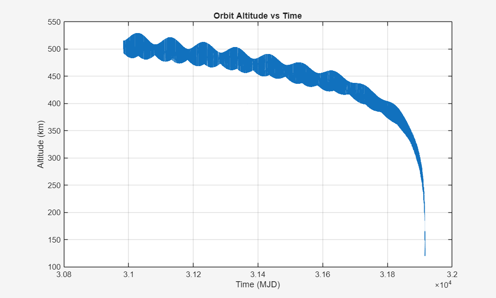
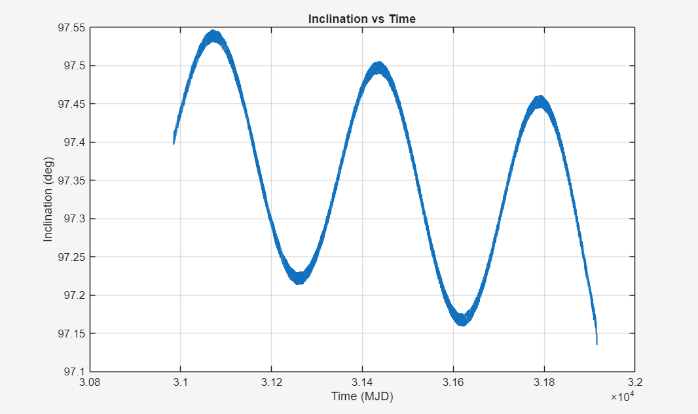
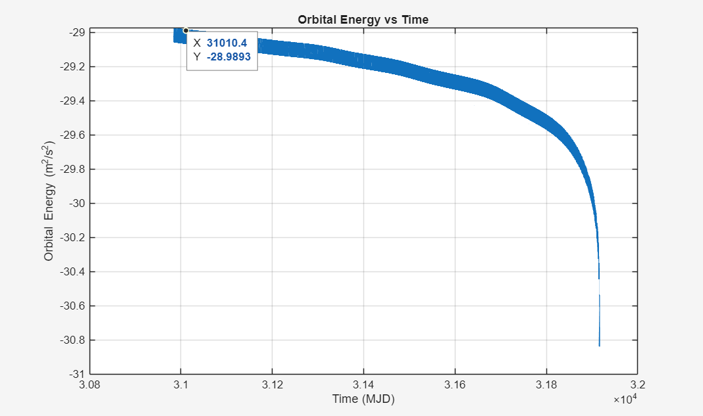
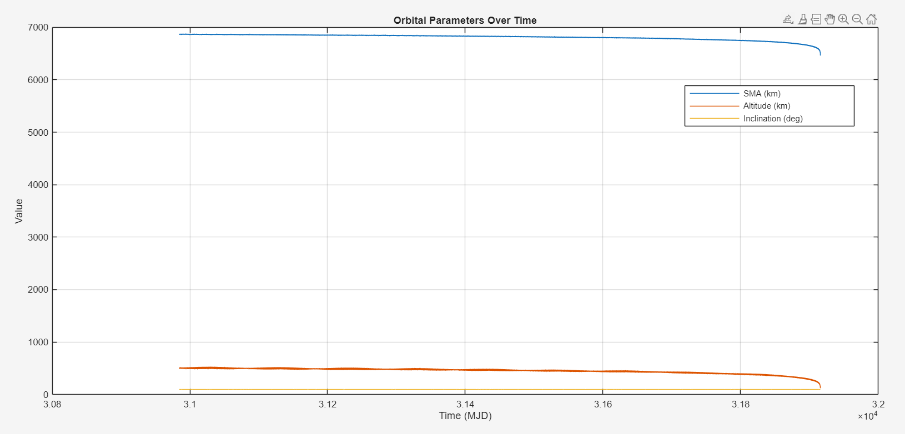
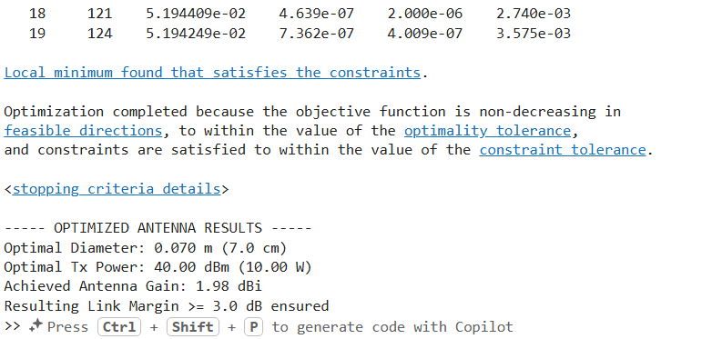
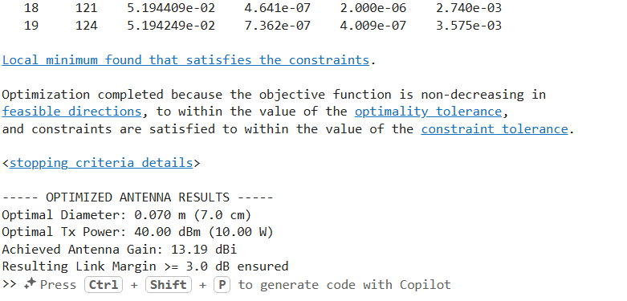
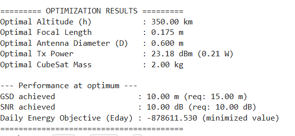

# CubeSat Mission Analysis: Lifetime and Link Optimisation

*Individual project · AE 404 Spacecraft Communication · Izmir University of Economics · November 2025*



## Engineering question
How long does a 4 kg CubeSat in a 500 km sun-synchronous orbit (SSO) survive before atmospheric re-entry? And which communication architecture closes the downlink for a wildfire-monitoring mission under CubeSat power, mass and aperture limits?

## Approach
- **Orbit propagation in GMAT:** 500 km SSO (SMA 6878 km, e = 0.001, i = 97.4°), 4 kg dry mass, drag area 0.03 m², C<sub>d</sub> = 2.2.
  - Force model: Earth gravity to degree and order 4 (J2–J4), Sun and Moon third bodies, Jacchia-Roberts atmospheric drag and solar radiation pressure.
  - Propagator: Runge-Kutta 89, propagated until the altitude reaches 120 km (re-entry).
- **Post-processing in MATLAB:** the GMAT ephemeris report is read to compute the lifetime and plot altitude, inclination, specific orbital energy and all orbital elements over time.
- **Link budget:** Friis equation at S-band (2.2 GHz), worst-case slant range of 1600 km, 2 W (33 dBm) transmit power, 12 dBi ground gain, 3.6 dB system losses, −108 dBm receiver sensitivity and a 3 dB required margin.
- **Antenna optimisation:** aperture–gain relation to size the antenna at S-band and X-band. MATLAB `fmincon` minimises the antenna mass (as a function of area) over diameter and transmit power, subject to the link-margin constraint.
- **Energy minimisation (formulation):** daily energy balance E<sub>day</sub> = E<sub>consumption</sub> − E<sub>solar</sub>, optimised over altitude, focal length, antenna diameter, transmit power and mass. Constraints cover GSD, SNR, lifetime, antenna size and mass, and revisit.

## Results
- **Orbital lifetime: 931.36 days (2.55 years)** until the altitude reaches 120 km.
- Worst-case FSPL at 2.2 GHz and 1600 km: 163.38 dB. The required spacecraft antenna gain is about 17 dBi for a 3 dB margin at 2 W.
- The required gain means a dish of about **40 cm at S-band** but only about **11 cm at X-band**, assuming 60 % aperture efficiency.
- An 8.5 dBi S-band patch array at 2 W gives −113.48 dBm, which is **5.48 dB below** the receiver sensitivity (the link does not close). Upgrading the ground station to a 20 dBi (1 m) dish gives −105.48 dBm, a **2.52 dB margin**.
- **Recommended architecture:** a hybrid system with a 2×2 S-band patch array (6–9 dBi) for TT&C and telemetry, plus a 10–12 cm deployable X-band dish (about 17 dBi) for the wildfire payload downlink.

## Validation
The lifetime is taken directly from the GMAT re-entry epoch and cross-checked in MATLAB from the exported ephemeris (first and last epoch). The link-budget numbers are worked out by hand in the report and confirmed with the MATLAB optimisation outputs (Figures 7–8).

## Figures
Figures are taken from the report (figure numbers and captions as in the report).


*Figure 2: GMAT orbital report showing the final re-entry timestamp.*


*Figure 3: Altitude decay due to atmospheric drag.*


*Figure 4: Inclination drift under J2 perturbation.*


*Figure 5: Energy decay indicating orbital dissipation.*


*Figure 6: Time evolution of orbital parameters.*


*Figure 7: Resulting optimised parameters for the antenna operating at 2.2 GHz.*


*Figure 8: Resulting optimised parameters for the antenna operating at 8 GHz.*


*Figure 9: Optimal parameters for minimal energy consumption.*

The header image is Figure 1 of the report: the GMAT 3D orbit view at the re-entry epoch.

## Repository contents
| Path | Content | Opens with |
|---|---|---|
| `report/Homewok_9.pdf` | Full report (19 pages) | Any PDF reader |
| `tools/gmat/OrbitMission.script` | GMAT mission used for the lifetime run (propagates until 120 km altitude or 1825 days and writes `OrbitResults.csv`) | [GMAT](https://sourceforge.net/projects/gmat/) (NASA General Mission Analysis Tool) |
| `tools/gmat/Orbit.script` | Simpler GMAT set-up script for the same CubeSat | GMAT |
| `code/matlab/matlab/LifetimeGMAT.m` | Lifetime from the GMAT ephemeris (appendix 8.1) | MATLAB |
| `code/matlab/matlab/Plots.m` | Altitude, inclination, energy and orbital-element plots (appendix 8.2) | MATLAB |
| `code/Antenna Optimization/code.m` | `fmincon` antenna diameter / transmit-power optimisation at S-band, f = 2.2 GHz (report Section 5.5.1) | MATLAB with the Optimization Toolbox |
| `code/matlab/matlab/code.m` | The same antenna optimisation at X-band, f = 8 GHz | MATLAB with the Optimization Toolbox |
| `code/matlab/matlab/energy.m` | Energy-minimisation problem (report Section 6, appendix 8.3): bounds, requirements and results printout | MATLAB with the Optimization Toolbox |
| `code/matlab/matlab/objective_Eday.m` | Objective: daily energy deficit E<sub>day</sub> = E<sub>consumption</sub> − E<sub>solar</sub> | MATLAB |
| `code/matlab/matlab/constraints_energy.m` | Nonlinear constraints: GSD, SNR, lifetime, antenna size, mass | MATLAB |
| `code/matlab/matlab/compute_GSD.m`, `compute_SNR.m`, `compute_lifetime.m`, `compute_revisit.m` | Helper models used by the constraints and results | MATLAB |
| `figures/` | Report figures | Image viewer |

**About the energy-minimisation code.** `objective_Eday.m` was extracted from appendix 8.3 of the report, because it was not among the original code files. Only PDF copy artefacts were fixed: the five `h = x(1); % altitude (km)`-style lines had been split into separate pieces by the PDF column layout and were rejoined, and a page number ("17") inside the listing was removed. The original `energy.m`, like the printed appendix, has no line that runs the optimiser. To reproduce Figure 9, add this line before the results printout:
```matlab
[xopt, fval] = fmincon(obj, x0, [], [], [], [], lb, ub, nonlcon, options);
```

**Not included:** `OrbitResults.xlsx`, the full GMAT ephemeris (about 75 MB), is too large for this repository, and the MATLAB `.fig` versions of the plots are not included either.

## How to reproduce
1. Open `tools/gmat/OrbitMission.script` in GMAT and run it. It writes the ephemeris report `OrbitResults.csv`.
2. Save the report as `OrbitResults.xlsx` (the MATLAB scripts read that file name) next to the MATLAB scripts.
3. Run `LifetimeGMAT.m` for the lifetime and `Plots.m` for the figures.
4. Run `code/Antenna Optimization/code.m` (S-band) and `code/matlab/matlab/code.m` (X-band) to reproduce Figures 7 and 8.
5. For Figure 9, add the `fmincon` line shown above to `energy.m` and run it from `code/matlab/matlab/`.

---
Kaoutar Ammara · Aerospace Engineer · [GitHub](https://github.com/Kiwiiiieee) · [LinkedIn](https://linkedin.com/in/kaoutar-ammara)
